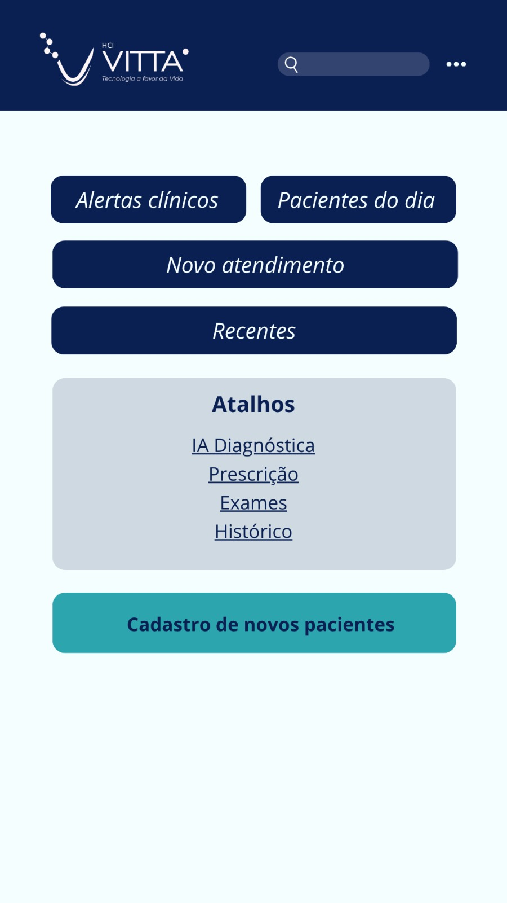

# 🏥 HCI Vitta - Triagem Clínica Inteligente


O **HCI Vitta** é um sistema moderno de suporte à decisão clínica projetado para o Hospital de Clínicas de Ijuí (HCI). Utilizando Inteligência Artificial Local e a arquitetura RAG (*Retrieval-Augmented Generation*), o sistema analisa sintomas, sugere condutas médicas baseadas no Protocolo de Manchester e **aprende continuamente** com o feedback dos médicos.

> ⚠️ **Nota Importante:** Este projeto foi desenvolvido estritamente para fins educacionais e acadêmicos. O diagnóstico preditivo gerado deve ser sempre validado por um profissional de saúde qualificado.

<p align="center">
  
</p>

---

## ✨ Principais Funcionalidades (Features)

- 🤖 **Triagem Assistida por IA**: Análise de sintomas e recomendação de classificação de risco em segundos.
- 📚 **Motor RAG Clínico**: Busca de casos históricos no `ChromaDB` através de Embeddings (`BioBERTpt-clin`) para gerar respostas embasadas e livres de alucinações.
- 🔄 **Aprendizado Contínuo (Active Learning)**: A IA é retroalimentada com as avaliações médicas! Triagens corrigidas e aprovadas no painel são sincronizadas com o banco vetorial, deixando a IA progressivamente mais inteligente para a realidade do hospital.
- 🛡️ **Arquitetura Baseada em Perfis**: Níveis de acesso distintos (`RECEPCIONISTA`, `ENFERMEIRO`, `MEDICO`, `ADMINISTRADOR`) gerenciados via PostgreSQL.

---

## 🛠️ Tecnologias Utilizadas

A stack do projeto foi dividida em microsserviços orquestrados pelo **Docker Compose**:

* **Frontend**: HTML5, CSS3 e JavaScript (Servido por Nginx).
* **Backend**: Node.js com Express (APIs RESTful e divisão de rotas).
* **IA Engine**: Python (FastAPI), LlamaIndex, Transformers e PyTorch.
* **LLM Local**: Mistral executado via Ollama (Privacidade total dos dados do paciente).
* **Bancos de Dados**:
  * PostgreSQL (Relacional - Perfis, Histórico, Validações).
  * ChromaDB (Vetorial - Casos Clínicos).

---

## 🚀 Como Executar o Projeto (Quick Start)

Graças à conteinerização, subir toda a infraestrutura requer poucos passos.

### 1. Pré-requisitos

* Ter o [Docker Desktop](https://www.docker.com/products/docker-desktop/) instalado e rodando.
* Ter o [Ollama](https://ollama.com/) instalado na máquina local.

Baixe o modelo LLM executando no seu terminal hospedeiro:

```bash
ollama pull mistral
```

### 2. Subindo a Aplicação

No terminal, navegue até a pasta raiz do projeto e utilize o Docker Compose:

```bash
# Navegue até a pasta do projeto
cd caminho/para/o/trabalhoPI5

# Construa e suba todos os serviços em segundo plano
docker-compose up -d --build
```

### 3. Acessos aos Serviços

Aguarde cerca de 30 segundos para o motor de IA carregar os tensores e o banco inicializar. O banco de dados já inicializa populado com usuários de teste e permissões graças ao script `init-db.sql`.

| Serviço | URL | Credenciais de Teste |
|---|---|---|
| 🌐 Frontend (Sistema) | http://localhost:5500 | Usuário: `carlos.medico` / Senha: `admin123` |
| 🔌 Backend (API Node) | http://localhost:3000 | - |
| 🎛️ Painel DB (pgAdmin) | http://localhost:8080 | E-mail: `admin@hcivitta.com` / Senha: `admin` |
| 🤖 Motor IA (FastAPI) | http://localhost:5000 | - |

---

## 🧠 Entendendo o Ciclo de Inteligência (RAG + Feedback)

1. **Entrada**: O enfermeiro insere anamnese e sintomas no formulário do painel.
2. **Vetorização**: O motor Python converte o texto em Embeddings matemáticos usando IA médica (BioBERTpt-clin).
3. **Busca Semântica**: O ChromaDB devolve o caso histórico mais parecido do hospital.
4. **Geração (LLM)**: O modelo Mistral recebe os sintomas + o caso similar e gera um parecer embasado (Classificação, Justificativa e Conduta).
5. **Validação Humana**: O parecer fica como `PENDENTE`. Um médico avalia, corrige se necessário e aprova.
6. **Evolução**: Ao iniciar, o motor Python varre o PostgreSQL, busca os novos casos validados e os injeta no ChromaDB. O ciclo recomeça, mais preciso do que antes!

---

## 📂 Estrutura do Projeto

```
trabalhoPI5/
├── backend-chatAI/          # Backend Node.js
│   ├── routes/              # Módulos de Rotas (ex: triagensRoutes.js)
│   ├── main.js              # Servidor Express principal
│   └── Dockerfile           # Imagem Node.js
├── IA_Engine/                # Motor de IA em Python
│   ├── api.py                # Servidor FastAPI e Lógica RAG + Sincronização DB
│   ├── chroma_db/             # Banco vetorial persistente
│   ├── requirements.txt       # Dependências (FastAPI, LlamaIndex, psycopg2, etc)
│   └── Dockerfile             # Imagem Python
├── frontend-chatAI/          # Frontend web (Painéis, Históricos, Chat)
│   └── front/                 # HTML, CSS, JS e Imagens
├── docker-compose.yml        # Orquestrador dos 5 microsserviços
├── init-db.sql               # Estrutura do Postgres, Triggers e Dados Iniciais
└── README.md                 # Este arquivo
```

---

## 🛣️ Roadmap e Melhorias Futuras

O MVP atingiu sua maturidade para testes operacionais. As próximas evoluções previstas incluem:

- [ ] **Segurança Avançada (JWT)**: Migrar de `localStorage` para JSON Web Tokens (JWT) trafegados via cookies HttpOnly, blindando a aplicação contra ataques XSS (em conformidade com a LGPD/HIPAA).
- [ ] **Paginação Dinâmica**: Implementar paginação avançada no SQL (Offset ou Cursor-based) para garantir alta performance no histórico conforme o volume de pacientes cresce.
- [ ] **WebSockets (Notificações Real-Time)**: Integração com Socket.io para alertar a equipe médica imediatamente na tela quando um paciente for classificado com "Risco Vermelho".